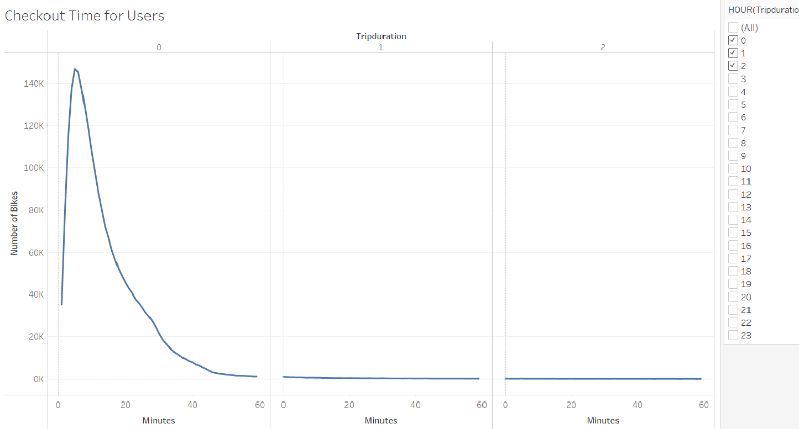
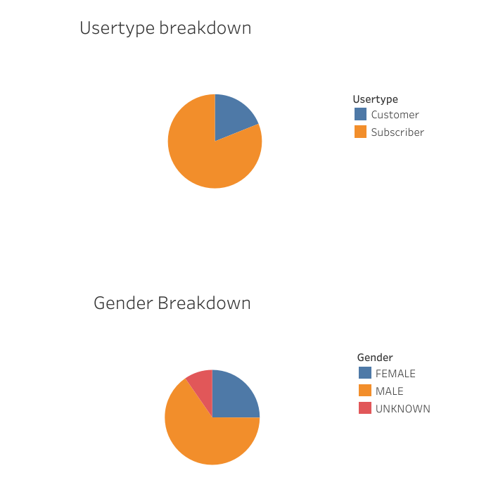
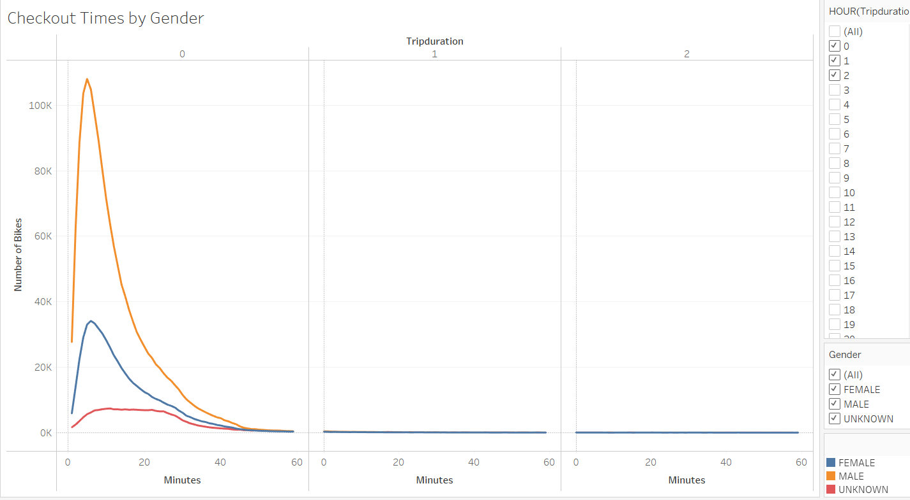
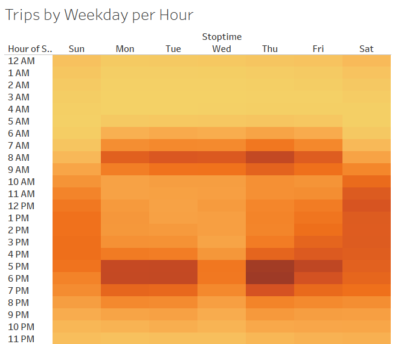
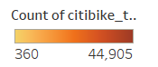
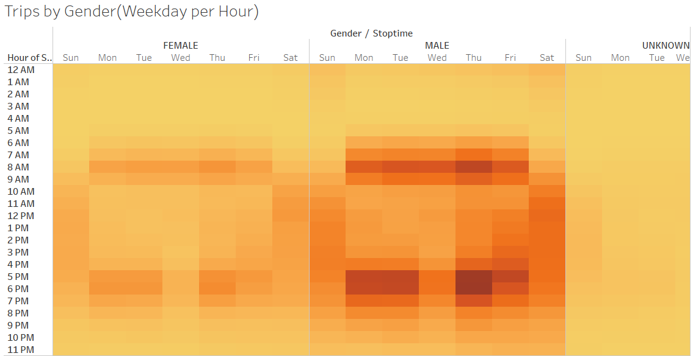
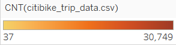
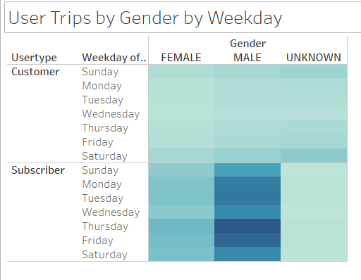
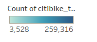
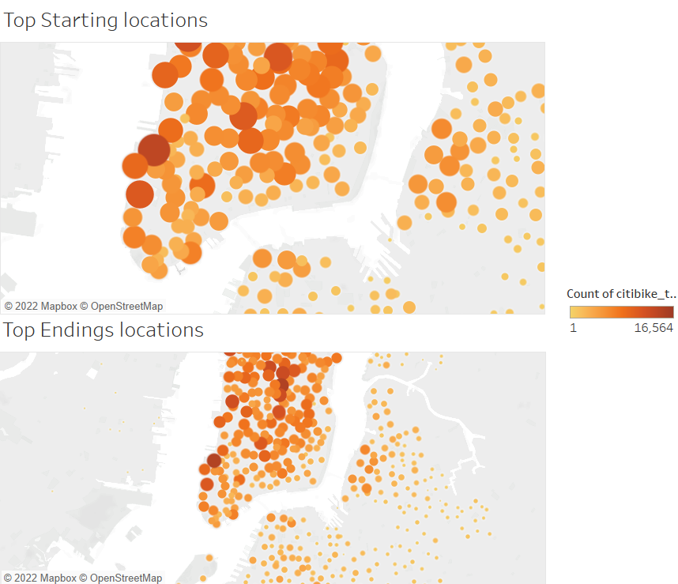

# bikesharing
The link to dashboard "https://public.tableau.com/app/profile/andres2863/viz/NYCBikeAnalysis_16579141305940/Story1?publish=yes"
## Overview of the analysis
The purpose of this project is to present a set of visualization that shows insights about citibike program in New york that helps and clarify the decision of investing a citibike program in Des Moines.
## Results

This represents the checkout time for Users, which the highest number of bikes are leaving between the 5 and 6 minute

These pie charts represents the breakdown by user and gender.

The second picture shows the checkout times by gender, the male people, who has the highest number of bikes, do the checkout between the 5 and 6 minutes. The female people get over their rides between the 5 and 7 minute

 

This nex picture allows to see the busiest time that peoples start trips by weeday and hour. The busiest time seems to be between 5pm and 6pm on Thursdays

 

The next picture is similar to the last picture but this one add gender. The less busiest time seems to be
between 10am and 3pm on Mondays and Tuesdays

 

In this picture, the male people who are suscriber tends to have trips regularly almost all the week. Followed up by Female people who are suscribers

The last picture represents the starting and ending locations, where darker circles means more trips and lighter circles less trips.

## Summary

In conclusion, the greates number of bikes used for trips are for less than 20 minutesand there is significant decreasing of number of bikes used along more minutes. There are more suscribers than customers and male people do more rides than female and unknown. In general, the busiest time are from 5pm to 7pm on Mondays, Tuesdays, Thursdays and Fridays. Finally, start and ending locations are likely to be closed to dowtown and Central Park.
